<!--
  ____          _            ____                _
 |  _ \ ___  __| |_ __ ___  |  _ \ ___ _ __ ___ (_)_ __ __ _
 | |_) / _ \/ _` | '__/ _ \ | |_) / _ \ '__/ _ \| | '__/ _` |
 |  __/  __/ (_| | | | (_) ||  __/  __/ | |  __/| | | | (_| |
 |_|   \___|\__,_|_|  \___/ |_|   \___|_|  \___||_|_|  \__,_|

-->

<div align="center">
  
  
  <a href="https://git.io/typing-svg">
    
  </a>

<br/><br/>

  <p>
    <a href="https://linkedin.com/in/pedro-pereira-vaz" target="_blank">
      
    </a>&nbsp;
    <a href="https://github.com/PedroPereiraVaz" target="_blank">
      
    </a>&nbsp;
    <a href="mailto:tuemail@gmail.com">
      
    </a>&nbsp;
    <a href="https://pedropereiravaz.github.io/PedroPereiraVaz/">
      
    </a>
  </p>
</div>

<br/>

<!-- Pixel Divider -->


<br/>

<!-- Who Am I: Valid Markdown Code Block -->

### 👨‍💻 Who Am I [Terminal Mode]

```console
user@pedro-pc:~$ ./whoami.sh --verbose

> ROLE:     Full Stack Developer & Odoo Specialist
> STACK:    Python, JavaScript, AWS, Odoo, React, Docker
> MISSION:  Building scalable solutions & optimizing workflows.
> STATUS:   Coding the future, one commit at a time.

# "Simplicity is the ultimate sophistication."
user@pedro-pc:~$ _
```

<br/><br/>

<!-- Featured Projects -->
<h2 align="center">
    
</h2>

<table border="0" align="center" width="100%">
  <tr>
    <!-- Project 1: AWS SES Tracker -->
    <td width="33%" valign="top">
       <div align="center">
           <h3><a href="https://github.com/PedroPereiraVaz/aws_ses_mail_tracking">📧 AWS SES Tracker</a></h3>
           <p>Módulo de Odoo para analytics de email en tiempo real con AWS SES.</p>
           
           <br/>
           <sub>Traceability & Analytics</sub>
       </div>
    </td>
    <!-- Project 2: Outlook Notifier -->
    <td width="33%" valign="top">
       <div align="center">
           <h3><a href="https://github.com/PedroPereiraVaz/microsoft_outlook_notifier">🔔 Outlook Automator</a></h3>
           <p>Bot preventivo para la expiración de tokens OAuth2 de Microsoft Azure.</p>
           
           <br/>
           <sub>Reliability & Automation</sub>
       </div>
    </td>
    <!-- Project 3: Dashboard Metricas -->
    <td width="33%" valign="top">
       <div align="center">
           <h3><a href="https://github.com/PedroPereiraVaz/dashboard_metricas_mail">📊 Mail Metrics Dash</a></h3>
           <p>Dashboard interactivo para visualizar el rendimiento de campañas de email.</p>
           
           <br/>
           <sub>Visualization & UX</sub>
       </div>
    </td>
  </tr>
</table>

<br/>

<!-- Divider -->


<br/>

<!-- Analytics -->
<h2 align="center">📈 GitHub Analytics</h2>

<div align="center">
  <!-- Dynamic Metrics generated by Action -->
  
  
</div>

<br/>

<!-- Snake Animation -->
<div align="center">
  <picture>
    <source media="(prefers-color-scheme: dark)" srcset="./assets/github-contribution-grid-snake-dark.svg">
    <source media="(prefers-color-scheme: light)" srcset="./assets/github-contribution-grid-snake.svg">
    
  </picture> 
</div>

<br/><br/>

<!-- Footer -->
<div align="center">
  
</div>
