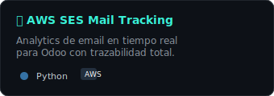
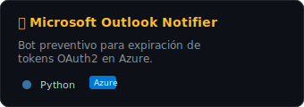
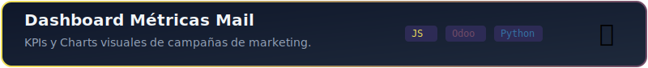

<!--
  ____          _            ____                _
 |  _ \ ___  __| |_ __ ___  |  _ \ ___ _ __ ___ (_)_ __ __ _
 | |_) / _ \/ _` | '__/ _ \ | |_) / _ \ '__/ _ \| | '__/ _` |
 |  __/  __/ (_| | | | (_) ||  __/  __/ | |  __/| | | | (_| |
 |_|   \___|\__,_|_|  \___/ |_|   \___|_|  \___||_|_|  \__,_|
-->

  
  

    &nbsp;
    &nbsp;
    
  

 

<!-- Identity: Full Width Terminal -->

### 👨‍💻 Identidad [Terminal Root]

  

 

<!-- Divider -->

 

<!-- Projects: Robust Standard Markdown Syntax -->
<h2 align="center">🚀 Proyectos Destacados</h2>

  
  
  

 

<!-- Divider -->

 

<!-- Stack: Flex Layout -->
<h2 align="center">🛠️ Arsenal Tecnológico</h2>

    <!-- Frontend -->
    

        <h4 align="center" style="margin-bottom: 5px;">Frontend</h4>
        
    

    <!-- Backend -->
    

        <h4 align="center" style="margin-bottom: 5px;">Backend</h4>
        
    

    <!-- Infra -->
    

        <h4 align="center" style="margin-bottom: 5px;">Infra</h4>
        
    

 

<!-- Metrics: External & Dynamic (Shields.io + Streak Stats) -->
<h2 align="center">📊 Métricas de Impacto</h2>

    <!-- Repos (Dynamic) -->
    
    &nbsp;&nbsp;
    <!-- Time (Dynamic) -->
    
      
    <!-- Commits (Streak Stats - External Service) -->
    

 

    <picture>
        <source media="(prefers-color-scheme: dark)" srcset="./assets/snake-dark.svg">
        <source media="(prefers-color-scheme: light)" srcset="./assets/snake.svg">
        
    </picture>

  

<!-- Footer -->

  

