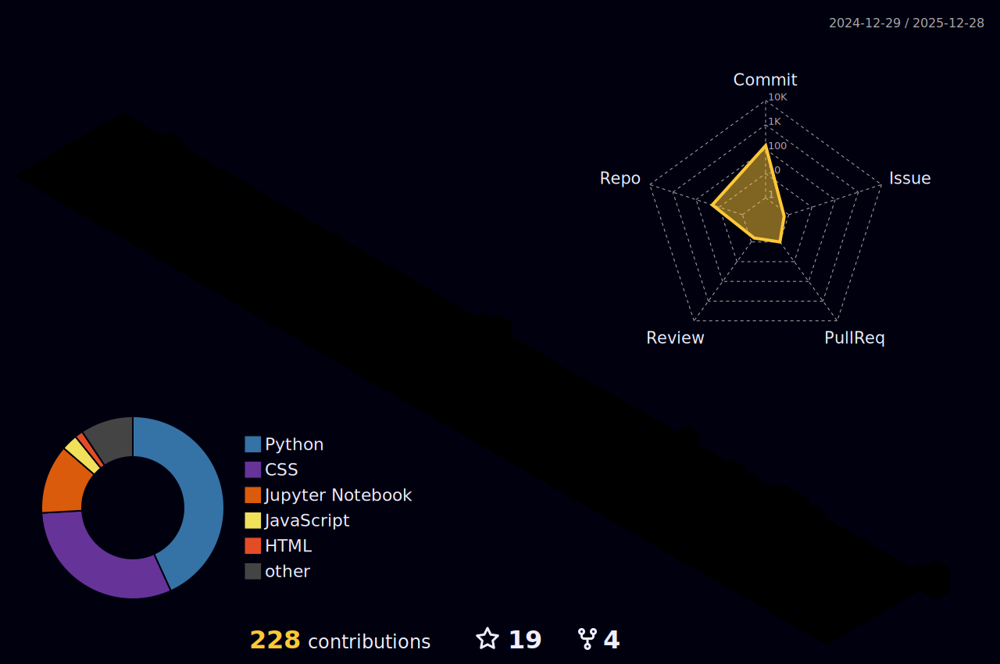

<!-- Header dinámico con onda de cápsula -->

  

  <!-- Typing SVG animado -->
  

  <!-- Redes sociales con badges modernos -->
  

    &nbsp;
    &nbsp;
    &nbsp;
    
  

 

<!-- Sección Intro: BENTO GRID Style -->
<table border="0" align="center" width="100%">
  <tr>
    <!-- Columna Izquierda: GIF -->
    <td width="35%" align="center" valign="middle">
       
    </td>
    <!-- Columna Derecha: Bio "Terminal" -->
    <td width="65%" valign="middle">
      

        <h3 style="color: #00FFFF; margin-top: 0;">> whoami</h3>
        

          👋 ¡Hola! Soy un desarrollador <b>híbrido</b> que vive en la intersección entre el código limpio y los datos masivos.
        

        

          🎯 <b>Mi Misión:</b> Crear aplicaciones web reactivas que no solo se vean increíbles, sino que tomen decisiones inteligentes impulsadas por datos.
        

        <ul style="list-style-type: none; padding-left: 0;">
          <li>🚀 <b>Stack Principal:</b> Python (Data) + JavaScript (Web).</li>
          <li>📊 <b>Obsesión actual:</b> Visualización de datos en tiempo real & Dashboards.</li>
          <li>⚡ <b>Mentalidad:</b> "Si es repetitivo, automatízalo."</li>
        </ul>
         
        
      

    </td>
  </tr>
</table>

 

<!-- Sección Proyectos Destacados -->
<h2 align="center">🚀 Proyectos Destacados</h2>

<table border="0" align="center" width="100%">
  <tr>
    <td width="33%" align="center" valign="top">
      
      
<b>🎨 Portfolio Neo-Brutalist</b> Diseño web audaz, animaciones CSS puro y estética premium.

    </td>
    <td width="33%" align="center" valign="top">
      
      
<b>☁️ AWS & Data Tracking</b> Monitoreo de emails y análisis de métricas en la nube.

    </td>
    <td width="33%" align="center" valign="top">
      
      
<b>🤖 Automation Bot</b> Notificaciones inteligentes y automatización de flujos de trabajo.

    </td>
  </tr>
</table>

 

<!-- Stack Tecnológico -->

  <h2>🛠️ Arsenal Tecnológico</h2>
  
  <table border="0" align="center">
    <tr>
      <td align="center" style="padding: 10px;">
        <h4 style="color: #8A2BE2;">💻 Frontend & UI</h4>
        
      </td>
      <td align="center" style="padding: 10px;">
        <h4 style="color: #00FFFF;">🧪 Data & Backend</h4>
        
      </td>
      <td align="center" style="padding: 10px;">
        <h4 style="color: #FF00FF;">☁️ Cloud & Tools</h4>
        
      </td>
    </tr>
  </table>

 

<!-- GitHub Stats Analytics -->
<h2 align="center">📈 GitHub Analytics</h2>

  <!-- 3D Contrib Green (Generated by Action) -->
  
  
    

  <!-- Stats Grid (Generated by Action - stored in 0-profile-details) -->
  <table align="center" border="0" width="100%">
    <tr>
      <td width="55%" align="center">
        <!-- Using Streak Stats (Usually reliable, if it fails we can remove) -->
        
      </td>
      <td width="45%" align="center">
        <!-- Summary Cards Generated Stats -->
        
         
        
      </td>
    </tr>
  </table>
  
  <!-- More Summary Cards -->
  

     
     
  

 

<!-- Cool Extra: Random Dev Quote -->

    

 

<!-- Snake Animation: Light/Dark Mode Supported -->
<h2 align="center">🐍 Contributions Snake</h2>

  <picture>
    <source media="(prefers-color-scheme: dark)" srcset="https://github.com/PedroPereiraVaz/PedroPereiraVaz/blob/output/github-contribution-grid-snake-dark.svg">
    <source media="(prefers-color-scheme: light)" srcset="https://github.com/PedroPereiraVaz/PedroPereiraVaz/blob/output/github-contribution-grid-snake.svg">
    
  </picture> 

  

<!-- Footer -->

  

