<!--
  ____          _            ____                _
 |  _ \ ___  __| |_ __ ___  |  _ \ ___ _ __ ___ (_)_ __ __ _
 | |_) / _ \/ _` | '__/ _ \ | |_) / _ \ '__/ _ \| | '__/ _` |
 |  __/  __/ (_| | | | (_) ||  __/  __/ | |  __/| | | | (_| |
 |_|   \___|\__,_|_|  \___/ |_|   \___|_|  \___||_|_|  \__,_|

-->

  

  

    &nbsp;
    &nbsp;
    
  

 

<!-- Who Am I: Real Terminal Effect -->

### 👨‍💻 Identidad [Terminal Root]

  # Inicializando sistema... 
  root@pedro-pc:~$ loading modules --verbose 
  > [OK] Python core loaded. 
  > [OK] Odoo framework active. 
  > [OK] AWS & Cloud infrastructure ready. 
   
  root@pedro-pc:~$ whoami 
  <!-- Dynamic Typing Last Line -->
  

 

<!-- Divider -->

 

<!-- Projects: Local SVGs (Generated by Action) -->
<h2 align="center">🚀 Proyectos Destacados</h2>

  <!-- These files will be generated in assets/ by the Action -->
  
  
    
  

 

<!-- Divider -->

 

<!-- Stack -->
<h2 align="center">🛠️ Arsenal Tecnológico</h2>

  

 

<!-- Metrics: Overview + Individual -->
<h2 align="center">📊 Métricas de Desarrollo</h2>

  <!-- Overview: Commits, Years, Repos (Local Asset) -->
  

 

  <!-- Snake Animation (Local Asset) -->
  <picture>
    <source media="(prefers-color-scheme: dark)" srcset="./assets/snake-dark.svg">
    <source media="(prefers-color-scheme: light)" srcset="./assets/snake.svg">
    
  </picture> 

  

<!-- Footer -->

  

