&nbsp;&nbsp;

 

 

<!-- PROJECTS -->
<h3 align="center">🚀 Últimos Proyectos</h3>

    

        
    

    

        
    

    

        
    

 
 
<!-- STACK -->
<h3 align="center">⚡ Stack</h3>

    

        <h3 style="color: #94a3b8; font-family: sans-serif; margin-bottom: 10px;">Frontend</h3>
        
    

    

        <h3 style="color: #94a3b8; font-family: sans-serif; margin-bottom: 10px;">Backend</h3>
        
    

    

        <h3 style="color: #94a3b8; font-family: sans-serif; margin-bottom: 10px;">Infra</h3>
        
    

 
<!-- METRICS -->
<h3 align="center">📊 Métricas</h3>

    <!-- Row 1: Badges -->
    &nbsp;&nbsp;
    &nbsp;&nbsp;
    
      
    <!-- Row 2: Streak -->
    

  
<!-- FOOTER -->

